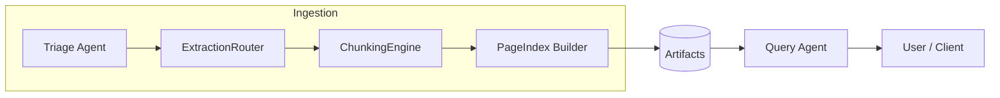
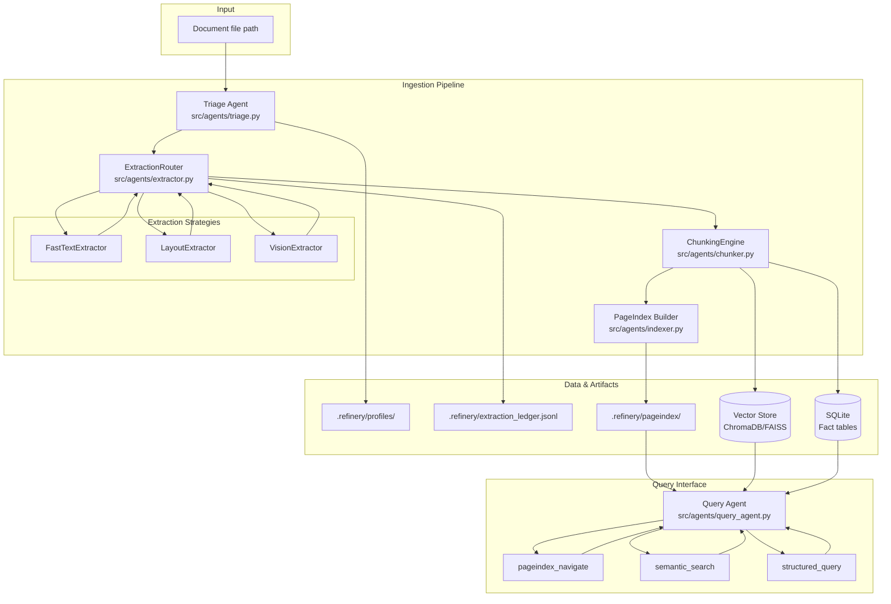
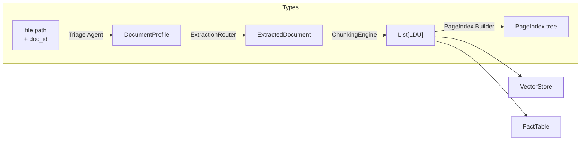
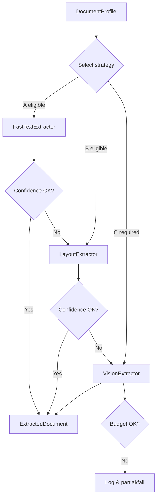
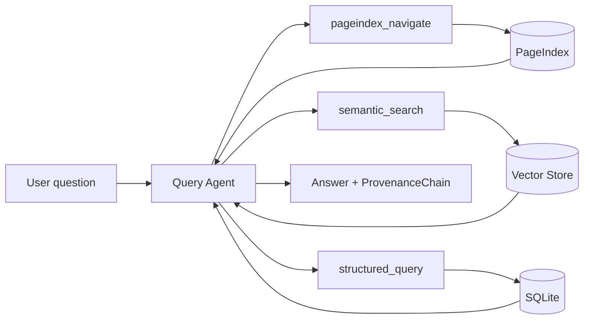
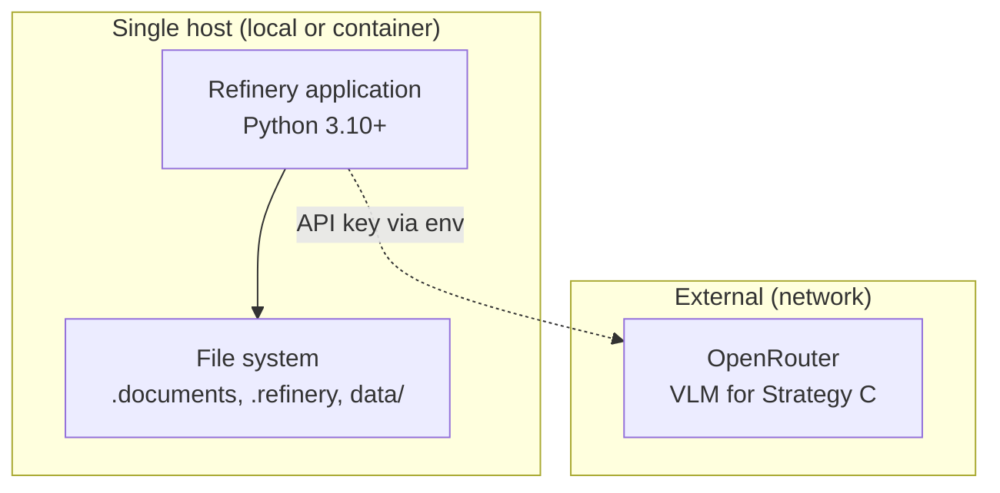

# System Architecture
## Document Intelligence Refinery

**Version:** 1.0  
**Status:** Draft  
This document describes the structure of the Document Intelligence Refinery: components, data flow, strategy selection and escalation, and deployment. It conforms to the [System Requirements Specification](system_requirement_spec.md) (SRS) and [Meta: Technical Standards & Implementation Governance](_meta.md) (_meta). Concrete interfaces and schemas are specified in [api_contracts.md](api_contracts.md).

---

## 1. Introduction

### 1.1 Purpose

The system architecture defines the **structure** of the Refinery: how pipeline stages are realized as components, how data flows between them, how extraction strategy and escalation are decided, and how the system is deployed. It provides a shared view for implementation and for the system_architecture content required by _meta §9.

### 1.2 Scope

- **In scope**: Ingestion pipeline (Triage → Extraction → Chunking → PageIndex), Query Interface agent and its tools, extraction strategy routing and escalation, artifact storage, and local/Docker deployment.
- **Out of scope**: Detailed API signatures (see api_contracts.md), requirement verification criteria (see SRS), and coding standards (see _meta).

### 1.3 References

| ID | Document |
|----|----------|
| SRS | [system_requirement_spec.md](system_requirement_spec.md) |
| _meta | [_meta.md](_meta.md) |
| api_contracts | [api_contracts.md](api_contracts.md) |

---

## 2. Architectural Overview

The Refinery is a **linear pipeline with conditional branching** inside the Extraction stage, followed by a **Query Interface** that operates over persisted artifacts. Ingestion and query are separate phases (BR-1).

- **Ingestion**: One entry point (e.g., pipeline runner or CLI) invokes stages in order. Each stage consumes and produces typed Pydantic models (NFR-1). The Extraction stage branches internally via ExtractionRouter and may escalate between strategies.
- **Artifacts**: DocumentProfile (per doc), ExtractedDocument (transient or cached), LDUs (fed to vector store), PageIndex (per doc), extraction_ledger.jsonl, vector store, SQLite fact tables.
- **Query**: The Query Agent runs after ingestion, using PageIndex, vector store, and fact tables to answer questions and attach a ProvenanceChain to every answer (FR-5.2).

---

## 3. Component Diagram

### 3.1 Component Descriptions

| Component | Location | Responsibility | SRS |
|-----------|----------|----------------|-----|
| **Triage Agent** | `src/agents/triage.py` | Classify document (origin_type, layout_complexity, language, domain_hint, estimated_extraction_cost); persist DocumentProfile to `.refinery/profiles/{doc_id}.json`. | FR-1.x |
| **ExtractionRouter** | `src/agents/extractor.py` | Select extraction strategy from DocumentProfile; invoke chosen extractor; apply confidence-gated escalation; normalize output to ExtractedDocument; append to extraction_ledger. | FR-2.5, FR-2.6, FR-2.8 |
| **FastTextExtractor** | `src/strategies/fast_text.py` | Low-cost extraction via pdfplumber/pymupdf; confidence scoring; output normalized to ExtractedDocument. | FR-2.1, FR-2.2 |
| **LayoutExtractor** | `src/strategies/layout.py` | Medium-cost extraction via MinerU or Docling; adapters normalize to ExtractedDocument. | FR-2.3, FR-2.7 |
| **VisionExtractor** | `src/strategies/vision.py` | High-cost extraction via VLM (OpenRouter); budget_guard; output normalized to ExtractedDocument. | FR-2.4, FR-2.9 |
| **ChunkingEngine** | `src/agents/chunker.py` | Convert ExtractedDocument → List[LDU]; enforce chunking rules via ChunkValidator; assign content_hash; optionally feed fact table. | FR-3.x, FR-5.3 |
| **PageIndex Builder** | `src/agents/indexer.py` | Build hierarchical PageIndex tree from document structure; LLM-generated section summaries; persist to `.refinery/pageindex/`. | FR-4.1, FR-4.3 |
| **Query Agent** | `src/agents/query_agent.py` | LangGraph agent with tools: pageindex_navigate, semantic_search, structured_query; attach ProvenanceChain to every answer; support Audit Mode. | FR-5.1–FR-5.5 |
| **Vector Store** | ChromaDB or FAISS | Store LDU embeddings for semantic_search. | FR-5.5 |
| **SQLite** | Fact tables | Store key-value facts from FactTable extractor; queried via structured_query. | FR-5.3 |

---

## 4. Pipeline Data Flow (Ingestion)

Data flows in typed form between stages. All types are Pydantic models in `src/models/` (DR-1). Exact schemas are in api_contracts.md.

| Step | Input | Output | Persisted |
|------|--------|--------|-----------|
| 1. Triage | Document path, doc_id | DocumentProfile | `.refinery/profiles/{doc_id}.json` |
| 2. Extraction | DocumentProfile, document path | ExtractedDocument | Ledger entry in `extraction_ledger.jsonl` |
| 3. Chunking | ExtractedDocument | List[LDU] | LDUs to vector store; facts to SQLite |
| 4. PageIndex | ExtractedDocument (or LDUs) + doc structure | PageIndex tree | `.refinery/pageindex/{doc_id}.json` |

The **orchestrator** (pipeline runner or CLI) is responsible for passing outputs as inputs to the next stage and for ensuring order. Stages do not call each other directly except via the router inside the Extraction stage (_meta §3.1).

---

## 5. Strategy Selection and Escalation

The ExtractionRouter selects strategy from DocumentProfile and applies an **Escalation Guard**: if the chosen strategy returns low confidence, the router retries with the next tier (FR-2.5, FR-2.6).

### 5.1 Strategy Selection (Initial)

| Condition (DocumentProfile) | Selected strategy | Cost tier |
|----------------------------|-------------------|-----------|
| origin_type = `scanned_image` | Vision (C) | High |
| origin_type = `native_digital` AND layout_complexity = `single_column` | Fast Text (A) | Low |
| origin_type = `mixed` OR layout_complexity in `multi_column`, `table_heavy`, `figure_heavy`, `mixed` | Layout (B) | Medium |
| Otherwise (e.g. `form_fillable`, edge cases) | Layout (B) or Vision (C) per rules | Medium / High |

Exact rules and thresholds (e.g. character count, image area ratio) are externalized in `rubric/extraction_rules.yaml` (IR-2).

### 5.2 Escalation Flow

- **Strategy A** must compute confidence (e.g. character count, image area). If below threshold → retry with **Strategy B**.
- **Strategy B** (if used after A or selected initially) may also expose confidence; if below threshold → retry with **Strategy C**.
- **Strategy C** is subject to **budget_guard**: if per-document token spend exceeds cap, stop and log (FR-2.9, BR-3).

---

## 6. Query Path

The Query Agent is a LangGraph agent that uses three tools over the ingested data:

| Tool | Purpose | Data source |
|------|---------|-------------|
| **pageindex_navigate** | Tree traversal; return top-K sections relevant to a topic before vector search. | `.refinery/pageindex/` |
| **semantic_search** | Vector retrieval over LDUs. | ChromaDB / FAISS |
| **structured_query** | SQL over extracted fact tables. | SQLite |

Every answer must include a **ProvenanceChain**: list of citations with document_name, page_number, bbox, content_hash (FR-5.2). **Audit Mode** (FR-5.4) takes a claim and returns either a verifying citation or "not found / unverifiable".

---

## 7. Data Stores and Artifacts

| Store / Artifact | Format | Producer | Consumer |
|------------------|--------|-----------|----------|
| **.refinery/profiles/** | JSON (DocumentProfile per doc) | Triage Agent | ExtractionRouter |
| **.refinery/extraction_ledger.jsonl** | JSONL (one object per line) | ExtractionRouter | Observability, debugging |
| **.refinery/pageindex/** | JSON (PageIndex tree per doc) | PageIndex Builder | Query Agent (pageindex_navigate) |
| **Vector store** | ChromaDB or FAISS (embeddings + metadata) | ChunkingEngine (ingestion step) | Query Agent (semantic_search) |
| **SQLite** | Fact tables (schema from FactTable extractor) | ChunkingEngine / FactTable extractor | Query Agent (structured_query) |

Ledger line fields (minimum): `strategy_used`, `confidence_score`, `cost_estimate`, `processing_time` (FR-2.8). Bounding boxes use a single documented format (e.g. pdfplumber-style) for provenance (DR-2).

---

## 8. Deployment View

The SRS and _meta assume **local execution** and optional **Docker** for the final deliverable.

- **Local**: Run pipeline and Query Agent from project root; documents and `.refinery/` on local or mounted paths; env vars for OpenRouter and config.
- **Docker**: Single image (Dockerfile recommended); mount volume for documents and optionally `.refinery/`; same env-based config. No multi-node or Kubernetes required.

---

## 9. Interface Summary

Concrete contracts (method signatures, schema fields, config shape, ledger schema) are in [api_contracts.md](api_contracts.md). This section summarizes boundaries:

- **Triage Agent**: Input: document path (and doc_id). Output: DocumentProfile. Side effect: write profile JSON.
- **ExtractionRouter**: Input: DocumentProfile, document path, config. Output: ExtractedDocument. Side effects: append to extraction_ledger; possibly escalate and call another strategy.
- **Extractors** (A/B/C): Common interface: input document path (and profile if needed); output ExtractedDocument + confidence (and cost for C). Adapters normalize external tool output to ExtractedDocument.
- **ChunkingEngine**: Input: ExtractedDocument, config (chunking rules). Output: List[LDU]. Side effects: write to vector store; optionally populate SQLite fact table.
- **PageIndex Builder**: Input: ExtractedDocument (or structured doc) + doc_id. Output: PageIndex tree. Side effect: write JSON to `.refinery/pageindex/`.
- **Query Agent**: Input: user question (and optional claim for Audit Mode). Output: answer text + ProvenanceChain. Uses tools: pageindex_navigate, semantic_search, structured_query.

All cross-stage payloads are Pydantic models; no untyped dict-only handoffs at these boundaries (NFR-1).

---

*End of System Architecture*
